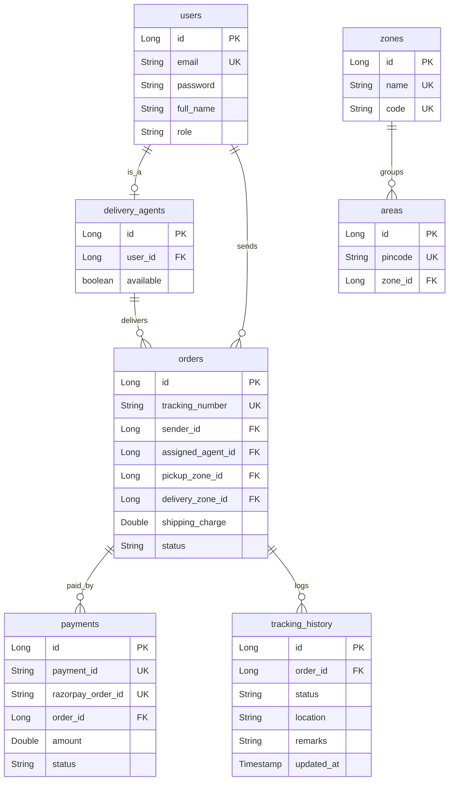

# LogiTrack - Last Mile Logistics Tracking System

LogiTrack is a production-grade, end-to-end Last Mile Logistics Tracking System. It features automated rate calculation, dynamic parcel routing, live driver GPS tracking streams, unified payment checkouts via Razorpay, real-time status updates via WebSockets (STOMP), and comprehensive reporting.

---

## Table of Contents
1. [Setup Guide](#1-setup-guide)
2. [Environment Configuration (`.env.example`)](#2-environment-configuration-evexample)
3. [API Documentation](#3-api-documentation)
4. [Database Schema & Architecture](#4-database-schema--architecture)
5. [Rate Calculation Logic](#5-rate-calculation-logic)

---

## 1. Setup Guide

### Prerequisites
* **Java Development Kit (JDK)**: Version 21
* **Database**: MySQL / TiDB (version 8.0+)
* **Build System**: Maven (wrapper included)
* **Frontend Runtime**: Node.js (version 18+) & npm

### Backend Configuration & Start
1. Ensure your local MySQL/TiDB instance is running and a database named `lastmile_tracker` exists:
   ```sql
   CREATE DATABASE lastmile_tracker;
   ```
2. Navigate to the backend directory:
   ```bash
   cd lastmile-backend
   ```
3. Set your active configuration parameters in `.env` (or let the default localhost values in `application.properties` take fallback effect).
4. Build and run the Spring Boot application using the Maven wrapper:
   ```bash
   # Windows
   .\mvnw.cmd spring-boot:run
   
   # Linux / macOS
   ./mvnw spring-boot:run
   ```
5. The backend will start on port `8084` with endpoints mapped under `/api`.

### Frontend Configuration & Start
1. Navigate to the frontend root folder:
   ```bash
   cd ..
   ```
2. Install npm dependencies:
   ```bash
   npm install
   ```
3. Build or run the local development server:
   ```bash
   # Start hot-reload server (localhost:5173)
   npm run dev
   
   # Compile production-ready static assets (output in /dist)
   npm run build
   ```

---

## 2. Environment Configuration (`.env.example`)

A `.env.example` file is included in the project root. To customize your production settings, create a `.env` file and populate the following keys:

| Environment Variable | Description | Default Fallback Value |
| :--- | :--- | :--- |
| `PORT` | Port number of the Spring Boot application | `8084` |
| `DB_URL` | JDBC Connection URL to MySQL/TiDB | `jdbc:mysql://localhost:3306/lastmile_tracker?createDatabaseIfNotExist=true&useSSL=false` |
| `DB_USERNAME` | Username for database access | `root` |
| `DB_PASSWORD` | Password for database access | `` |
| `JWT_SECRET` | 256-bit Hex signature key for JWT tokens | `9a4f2c5d8e1a3b7c6d...` |
| `SMTP_HOST` | Host address of SMTP server | `smtp.gmail.com` |
| `SMTP_PORT` | Port number of SMTP server | `587` |
| `SMTP_USERNAME` | Username email address for SMTP mail auth | `adityaprajapati4405@gmail.com` |
| `SMTP_PASSWORD` | App password code for SMTP mail auth | `inbvoqrsjeckrcee` |
| `RAZORPAY_KEY` | Razorpay public Key ID | `rzp_test_T98uakJBS29XZ1` |
| `RAZORPAY_SECRET` | Razorpay secret API Key | `imEBgG9qbH573DkkYzjtyRpF` |
| `VITE_APP_MODE` | Frontend mock vs live api selector | `live` |
| `VITE_API_BASE_URL` | Frontend API target destination | `http://localhost:8084` |
| `VITE_WS_URL` | Frontend WebSocket SockJS broker endpoint | `http://localhost:8084/ws` |

---

## 3. API Documentation

LogiTrack exposes self-documenting REST APIs powered by **Springdoc OpenAPI (Swagger UI)**.

* **Swagger HTML Endpoint**: `http://localhost:8084/swagger-ui/index.html`
* **JSON API Specification**: `http://localhost:8084/v3/api-docs`

### Major REST Endpoint Modules
* **Authentication (`/api/auth`)**:
  * `POST /api/auth/register`: Create a new user (with dynamic validation for CUSTOMER, DELIVERY_AGENT, or ADMIN).
  * `POST /api/auth/login`: Authenticate credentials, return JWT access and refresh tokens.
  * `POST /api/auth/refresh`: Obtain a new access token using a refresh token.
* **Orders & Consignments (`/api/orders`)**:
  * `POST /api/orders`: Submit new booking details, trigger routing/charges check.
  * `GET /api/orders/{id}`: Look up specific order invoice details.
  * `PUT /api/orders/{id}/assign`: Dispatch delivery associate to a consignment.
* **Payments (`/api/payments`)**:
  * `POST /api/payments/create-order`: Calculate charges and initiate a checkout order with Razorpay.
  * `POST /api/payments/verify`: Atomically verify HMAC signature, save payment, and commit the order.
* **Tracking (`/api/tracking`)**:
  * `GET /api/tracking/{trackingNumber}`: Public tracking endpoint returning live parcel journey history.

---

## 4. Database Schema & Architecture

The database is built on MySQL/TiDB with strict relational constraints, indexed fields for quick query resolutions, and automatic auditing triggers.



---

## 5. Rate Calculation Logic

Shipping charges are computed dynamically using the package dimensions, package weight, pickup/delivery zone mappings, and the configured **Rate Cards**.

### 1. Dimensional Weight (Volumetric) Check
To account for low-density packages that occupy significant space, the system compares the actual physical weight with the volumetric (dimensional) weight using the logistics standard divisor factor (`5000`):
$$\text{Volumetric Weight (kg)} = \frac{\text{Length (cm)} \times \text{Breadth (cm)} \times \text{Height (cm)}}{5000}$$

$$\text{Billable Weight (kg)} = \max(\text{Actual Weight}, \text{Volumetric Weight})$$

### 2. Zone Pricing Mode
The system maps the pickup pincode and delivery pincode to their respective **Zones** via the `Area` table.
* **Intra-Zone**: If both pincodes are registered under the same Zone code.
* **Inter-Zone**: If the pickup and delivery pincodes cross boundaries into different zones.

### 3. Price Formula
The rate card dictates pricing boundaries for B2B/B2C categories:
$$\text{Shipping Charge} = \text{Base Price} + \left( \lceil\text{Billable Weight} - \text{Base Weight Limit}\rceil \times \text{Additional Price Per kg} \right) \times \text{Zone Multiplier}$$
* **COD Charge**: If the package payment mode is COD (Cash on Delivery), an additional flat surcharge is appended (e.g. `GST` taxes or `COD Handling Fee`).
